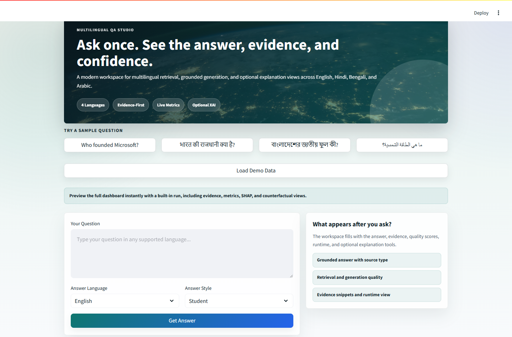

# Multilingual QA RAG Dashboard

A multilingual question-answering system built with Retrieval-Augmented Generation (RAG). The app accepts questions in English, Hindi, Bengali, and Arabic, retrieves supporting evidence, generates an answer, and shows evaluation plus explainability views in a Streamlit dashboard.

The current version is optimized for a complete local demo: retrieval, translation, answer generation, metrics, evidence review, SHAP-style feature importance, and counterfactual analysis are all available from one UI.



## Current Status

- Main app: `app.py`
- Active generator: Qwen2.5 1.5B Instruct GGUF
- Active model path: `models/qwen2.5-1.5b-instruct-q4_k_m.gguf`
- UI framework: Streamlit
- Retrieval: FAISS dense search plus BM25 sparse search
- Translation: NLLB-200 distilled model
- Supported languages: English, Hindi, Bengali, Arabic
- Runtime note: generation is CPU-based, so answers can take time on low-power machines.

## Features

- Multilingual question input
- Automatic language detection
- Hybrid retrieval using FAISS and BM25
- Query normalization and expansion for multilingual/code-mixed questions
- Context-grounded answer generation
- Role-based answer style: beginner, student, teacher
- Source/evidence display
- Evaluation metrics for retrieval, generation, faithfulness, and confidence
- Runtime dashboard for retrieval, generation, evaluation, and total time
- SHAP-style query/context importance views
- Counterfactual and what-if analysis
- Clean Streamlit dashboard with demo data preview

## Project Structure

```text
multilingual_qa/
  app.py                         Streamlit dashboard
  config.py                      Paths, model settings, retrieval settings
  main.py                        Optional CLI phase launcher
  requirements.txt               Python dependencies
  run_streamlit.bat              Windows helper to start the UI

  generation/
    qa_generator.py              Local GGUF answer generation

  retrieval/
    search.py                    Main retriever
    bm25_index.py                Sparse keyword retrieval
    build_faiss.py               FAISS index builder
    query_normalizer.py          Multilingual query normalization
    query_expander.py            Query expansion rules

  evaluation/
    metrics.py                   Retrieval and generation metrics
    faithfulness.py              Faithfulness scoring
    fairness_metrics.py          Language fairness helpers

  explainability/
    shap_explainer.py            SHAP-style explanations
    counterfactual_explainer.py  Counterfactual analysis

  datasets_loader/
    corpus_streamer.py           Dataset preparation/chunking

  embeddings/
    embed_corpus.py              Embedding/index preparation

  data/
    processed/                   Language chunk files
    indexes/                     FAISS index and metadata

  models/                        Local GGUF model files
  outputs/                       Generated plots useful for reports
```

## Models Used

| Purpose | Model |
| --- | --- |
| Embeddings | `sentence-transformers/paraphrase-multilingual-MiniLM-L12-v2` |
| Translation | `facebook/nllb-200-distilled-600M` |
| Generation | `Qwen2.5-1.5B-Instruct-GGUF`, Q4_K_M |
| Optional older local models | Qwen2.5 3B GGUF, Mistral 7B GGUF |

The active generation model is configured in `config.py`:

```python
MISTRAL_MODEL_PATH = "models\\qwen2.5-1.5b-instruct-q4_k_m.gguf"
GENERATION_MAX_TOKENS = 140
GENERATION_N_CTX = 1536
GENERATION_CONTEXT_LIMIT = 1200
```

The variable name still says `MISTRAL_MODEL_PATH` for compatibility with the existing code, but it currently points to Qwen.

## Setup

Create and activate a Python environment:

```powershell
python -m venv qa_env
qa_env\Scripts\activate
python -m pip install --upgrade pip
python -m pip install -r requirements.txt
```

If `llama-cpp-python` fails on Windows or crashes due to CPU instruction support, reinstall it with conservative CPU flags. This project has already been tested with `llama-cpp-python==0.3.26`.

## Running The Dashboard

Start Streamlit:

```powershell
python -m streamlit run app.py
```

Then open:

```text
http://localhost:8501
```

On Windows, you can also use:

```powershell
run_streamlit.bat
```

## Basic Usage

1. Open the dashboard.
2. Choose or type a question.
3. Select role and target answer language.
4. Run the query.
5. Review the generated answer, scores, retrieved evidence, runtime, SHAP view, and counterfactual view.

Sample questions:

```text
Who founded Microsoft?
भारत की राजधानी क्या है?
বাংলাদেশের জাতীয় ফুল কী?
ما هي الطاقة الشمسية؟
```

## Runtime Notes

The app runs generation locally through `llama-cpp-python`. On CPU, generation can be slow.

Typical observed behavior on this setup:

- Retrieval: around 1 second
- Generation: the slowest stage
- Qwen2.5 1.5B loaded short-answer test: about 20 seconds
- Larger models improve quality but increase runtime

This is expected for local CPU inference. For faster generation, use GPU acceleration or a hosted inference API while keeping retrieval/evaluation local.

## Evaluation And Explainability

The dashboard includes:

- Retrieval quality
- Answer generation quality
- Faithfulness score
- Confidence score
- Runtime timeline
- Retrieved document previews
- SHAP-style query/context importance
- Counterfactual word-removal analysis
- Manual what-if comparison

These metrics are useful for project demonstration and comparison, but they are approximate and should be presented as diagnostic signals rather than perfect ground truth.

## Final Demo Checklist

Use this flow for presentation:

1. Show the dashboard landing view.
2. Run one English question.
3. Explain the retrieved evidence section.
4. Show the generated answer and scores.
5. Open the runtime timeline and mention CPU generation limitation.
6. Show SHAP/context importance.
7. Show counterfactual or manual what-if.
8. Run one non-English question to demonstrate multilingual support.

## Limitations

- CPU generation is slower than hosted or GPU inference.
- Smaller models are faster but may reduce answer depth.
- Translation quality can affect non-English answers.
- Metrics and explainability views are heuristic.
- The app reads MLflow-style history if available, but current dashboard runs primarily store timings in Streamlit session state.

## Recommended Future Work

- Add persistent run logging to SQLite or CSV.
- Add Fast/Balanced/Quality generation modes.
- Add optional hosted API generation backend.
- Add GPU configuration for `llama-cpp-python`.
- Add a compact benchmark page for language-wise performance comparison.

